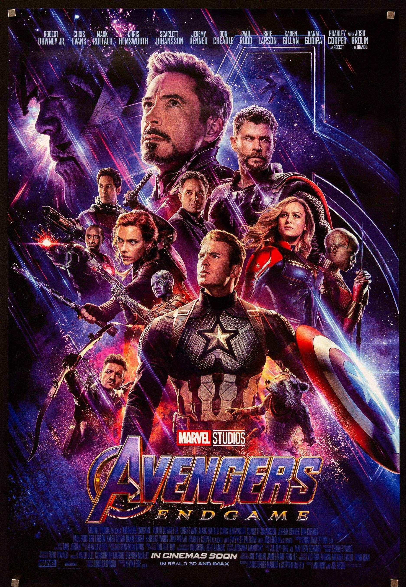
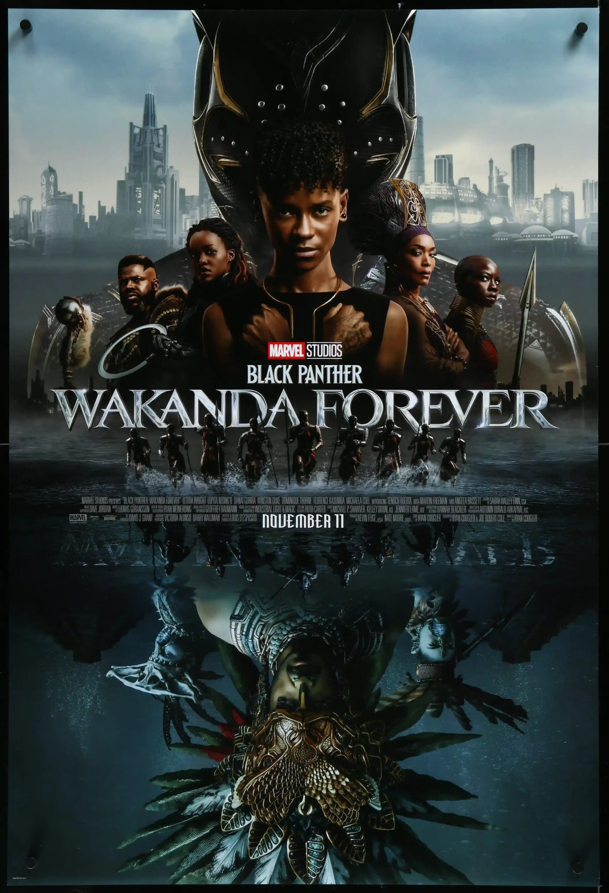
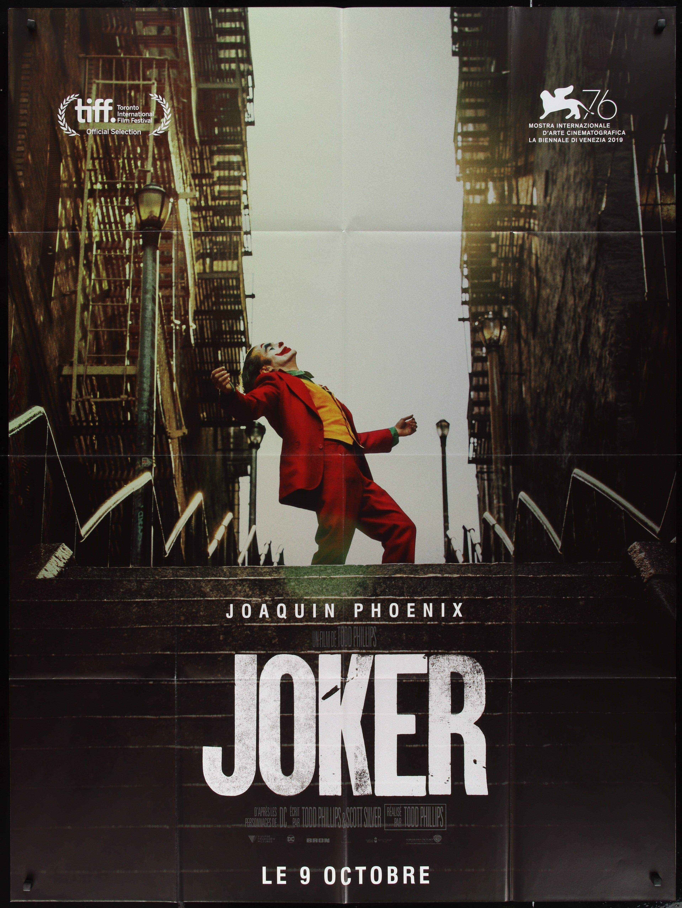
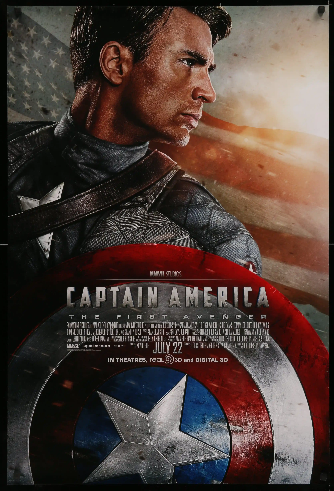
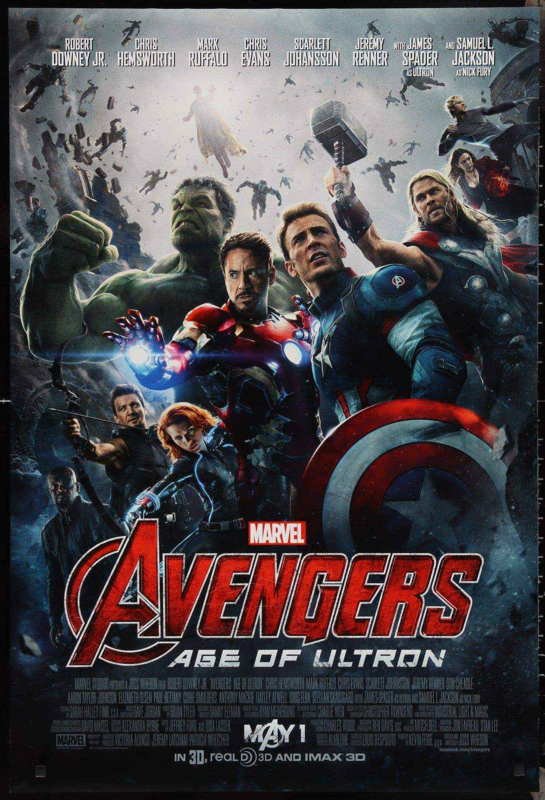
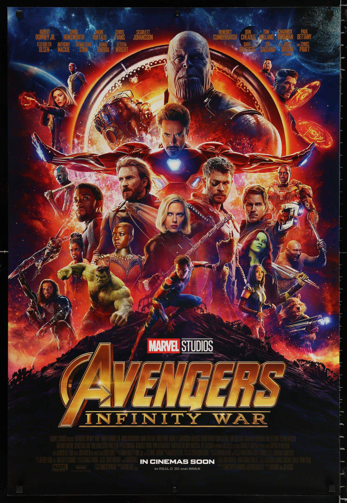
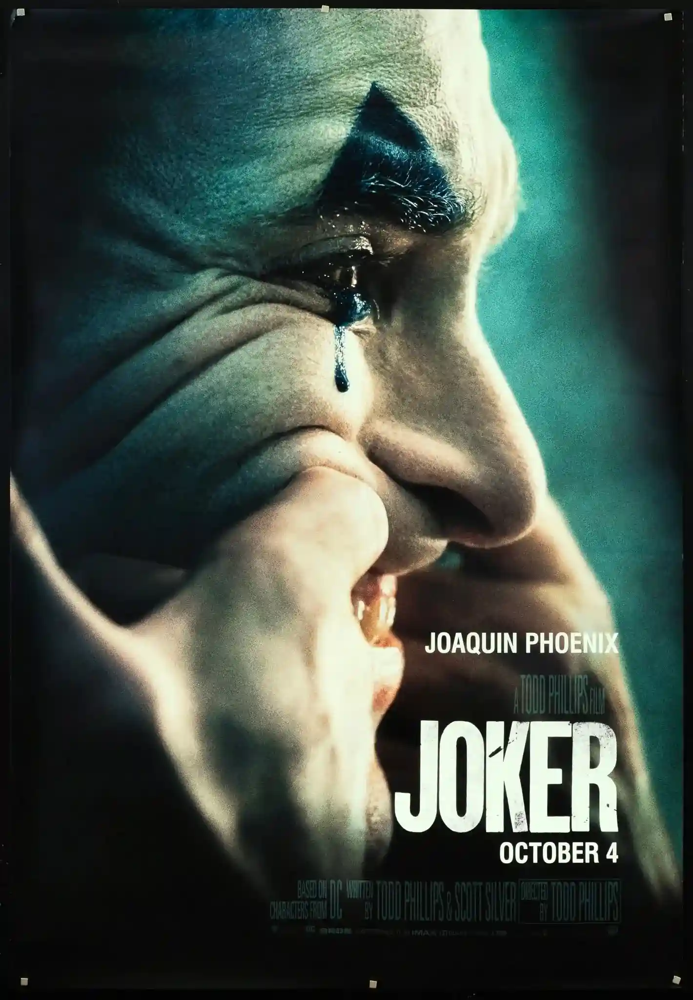

# 3D Rotating Movie Gallery

## Overview

This project is a **3D rotating image gallery** built using only **HTML and CSS**.

It displays a set of movie posters arranged in a circular 3D carousel.
The gallery rotates continuously, creating a smooth spinning effect with no JavaScript.

---

## What This Code Does

This project implements:

* A **continuous 3D rotation animation**
* A **circular image gallery**
* **Layered poster positioning** using CSS transforms
* Smooth **perspective-based depth**
* A clean centered layout

It is a solid example of **CSS 3D transforms and animation**.

---

## Technologies Used

* HTML5
* CSS3
* CSS 3D Transforms
* CSS Animations
* Flexbox

---

## File Structure

```bash
index.html   → Gallery structure
styles.css   → Styling and rotation animation
images       → Movie poster files
```

---

## HTML Breakdown

### Main Layout

```html
<div class="container">
    <span style="--i:1"></span>
    <span style="--i:2"></span>
    <span style="--i:3"></span>
    <span style="--i:4"></span>
    <span style="--i:5"></span>
    <span style="--i:6"></span>
    <span style="--i:7"></span>
    <span style="--i:8"></span>
</div>
```

### Structure Meaning

* `.container`
  Holds the full rotating gallery.

* `span`
  Each span acts as one image holder placed around the circle.

* `--i`
  A custom CSS variable used to position each image at a different angle.

* `img`
  The movie poster displayed inside each slot.

---

## CSS Breakdown

## 1. Page Layout

```css
body {
    background-color: #b9c1cd;
    display: flex;
    justify-content: center;
    align-items: center;
    min-height: 100vh;
}
```

This centers the gallery in the middle of the page and gives the page a soft background color.

---

## 2. Image Size

```css
img {
    height: 200px;
    width: 120px;
}
```

This sets every poster to the same size so the gallery looks neat and uniform.

---

## 3. Gallery Container

```css
.container {
    width: 120px;
    height: 200px;
    position: relative;
    transform-style: preserve-3d;
    transform: perspective(1000px);
    animation: gallery 20s linear infinite;
    cursor: pointer;
}
```

This creates the main 3D space for the gallery.

Important parts:

* `position: relative` keeps child elements positioned inside it
* `transform-style: preserve-3d` keeps the 3D effect active
* `perspective(1000px)` makes the depth look realistic
* `animation` rotates the gallery forever
* `cursor: pointer` makes it feel interactive

---

## 4. Positioning Each Image

```css
.container span {
    position: absolute;
    width: 100%;
    height: 100%;
    transform-style: preserve-3d;
    transform: rotateY(calc(var(--i)*45deg)) translateZ(350px);
}
```

This is the core of the carousel.

Each image is rotated around the Y-axis by a different angle and pushed outward using `translateZ(350px)`.

Since there are 8 images, each one is spaced by **45 degrees**:

* 360 ÷ 8 = 45

That is why the posters form a full circle.

---

## 5. Image Styling

```css
.container span img {
    position: absolute;
    border-radius: 10px;
    border: 6px ridge #ccc;
}
```

This styles each poster with rounded corners and a visible border, giving it a framed look.

---

## 6. Rotation Animation

```css
@keyframes gallery {
    0% {
        transform: perspective(1000px) rotateY(0deg);
    }

    100% {
        transform: perspective(1000px) rotateY(360deg);
    }
}
```

This makes the whole gallery spin from 0 to 360 degrees continuously.

The result is a smooth rotating 3D movie poster carousel.

---

## How It Works

1. The posters are placed around an invisible circle
2. Each poster gets a unique angle using `--i`
3. `translateZ(350px)` pushes them outward
4. The whole container rotates on the Y-axis
5. The user sees a 3D spinning gallery